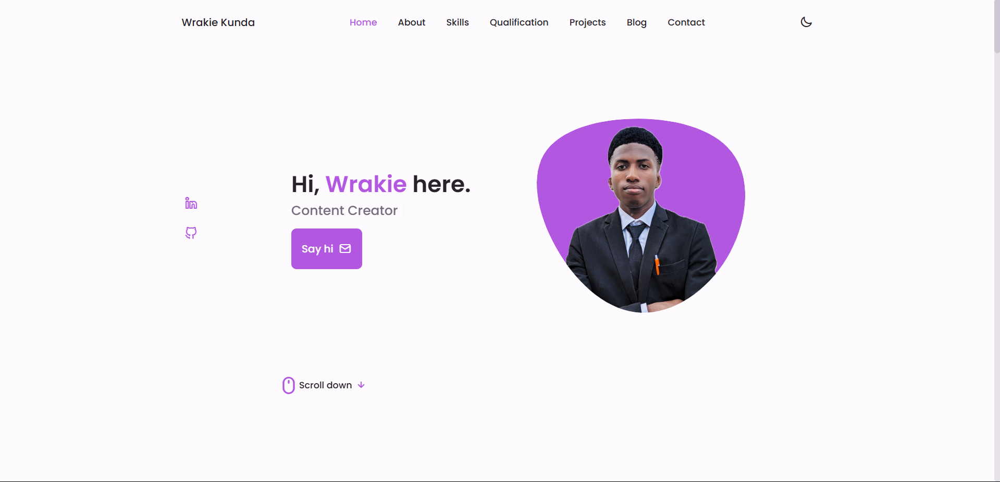

# 🌟 Wrakie Kunda's Personal Portfolio

Welcome to my personal portfolio website! 🎉 This repository showcases my journey as a computer science student, content creator, and aspiring tech entrepreneur. 🚀

## 💻 About the Project

This portfolio website is designed to:
- 📈 Highlight my technical skills, projects, and achievements.
- 🎨 Showcase my expertise in programming, graphics design, and video production.
- 🛠️ Serve as a platform for potential collaborations and opportunities.

## 🚀 Features

- 🖥️ **Responsive Design**: Optimized for all devices.
- 🔍 **Easy Navigation**: Simple and intuitive user interface.
- 🌐 **Dynamic Content**: Regular updates with my latest projects, blog posts, and achievements.
- 📞 **Contact Section**: Easily get in touch with me.

## 🛠️ Technologies Used

- **Frontend**: HTML5, CSS3, JavaScript
- **Tools**: Visual Studio Code, GitHub
- **Version Control**: Git
- **Hosting**: Firebase

## 🚧 How to Use

1. Clone this repository:  
   ```bash
   git clone https://github.com/Wrakie/My-Portfolio-Website.git
   ```
2. Open the `index.html` file in your browser or host it on a web server.
3. Explore and enjoy! 🎉

## 📬 Get in Touch

Feel free to connect with me:  
📧 **Email**: wrakiekunda@gmail.com 
🌐 **LinkedIn**: [Linkedin](https://www.linkedin.com/in/wrakie-kunda-092830246)
💼 **Upwork**: [Upwork](https://www.upwork.com/freelancers/~01c5d6609f32f745d8?mp_source=share)

## 🙌 Acknowledgments

Thanks to everyone who has supported my journey so far! Your encouragement keeps me going. 💙

## ⭐ Contributing

Found an issue or want to contribute?  
1. Fork the repository.
2. Create a new branch: `git checkout -b feature-name`.
3. Commit your changes: `git commit -m "Add feature-name"`.
4. Push to the branch: `git push origin feature-name`.
5. Open a pull request.

## 🌟 Highlights



## 📜 License

This project is licensed under the MIT License. 📝

Thank you for visiting my portfolio! 🎉 Don’t forget to ⭐ the repository if you like it!
